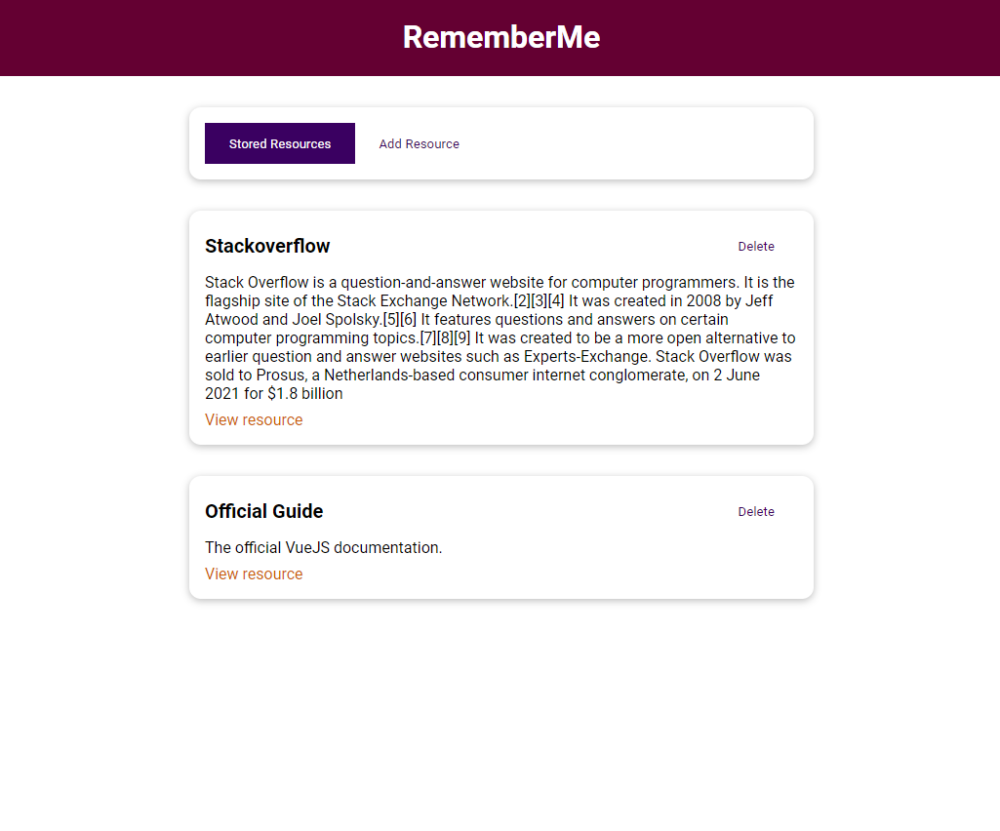
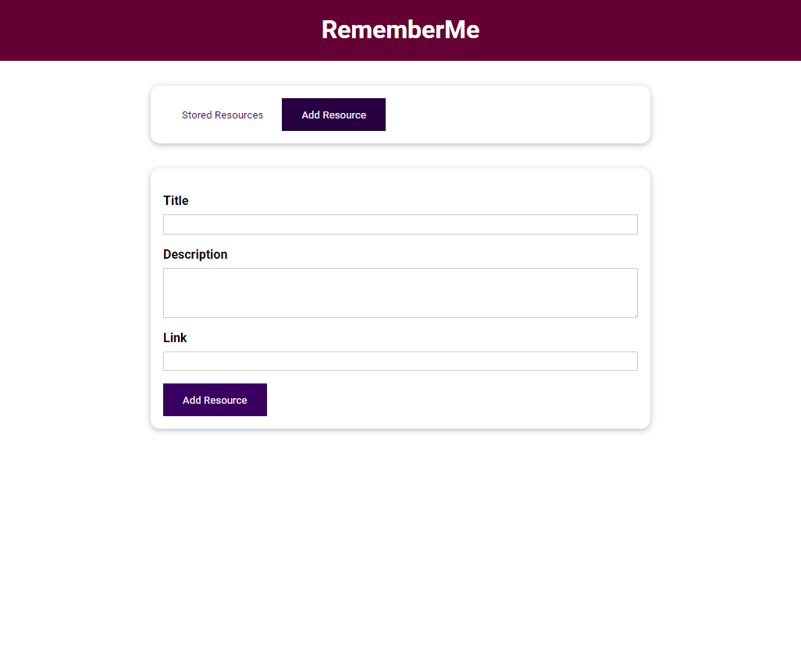
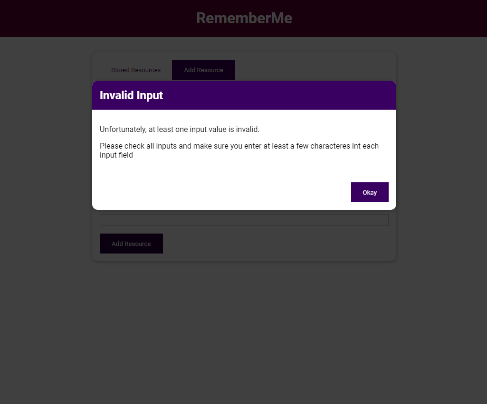

<h1 align="center">RememberMe</h1>

  

  

  

## 🚀 Tecnologias

Esse projeto foi desenvolvido com as seguintes tecnologias:

- HTML
- CSS
- JavaScript
- VueJS

## 💻 Projeto

Um App simples para adicionar, listar e excluir resources. A ideia desse projeto simples é praticar fundamentos básicos, essenciais e mais avançados no VueJS.

---

Feito com ♥ by Cleber-Risu
